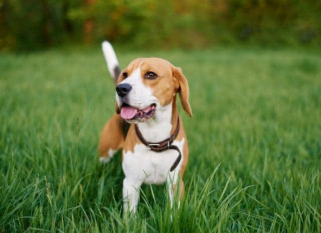

# DL-Photo-Caption-Generator
Deep Learning Photo Caption Generator Tensorflow 2.0

## Results
* dog is running through the grass

* two people are sitting on bench in front of large fountain 

* man in red shirt is standing on mountaintop

## Author: 
- Cesar Arcos-Gonzalez: cesar99ag@gmail.com

## Tools:
- Python 3

## License: 
MIT License

